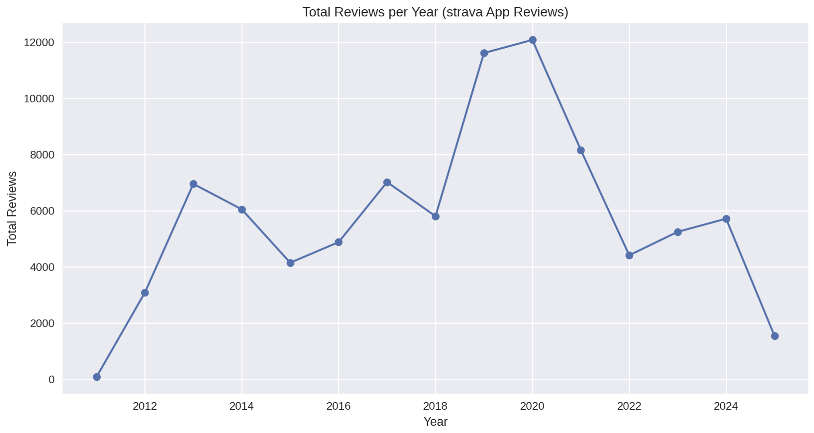

# 📊 Sentiment Analysis of STRAVA App Reviews

### 🧑‍💻 Author: Andika Insan Patria

#### 📌 NRP: 5026221211
#### 📚 Mata Kuliah: Pengolahan Bahasa Alami (PBA)
#### 🏫 Institut Teknologi Sepuluh Nopember (ITS)

---

## 📝 Deskripsi Singkat

STRAVA adalah aplikasi pelacak aktivitas olahraga yang populer di kalangan pelari dan pesepeda. Dengan jutaan unduhan di Google Play Store, STRAVA menerima berbagai ulasan dari penggunanya.
Penelitian ini bertujuan untuk mengevaluasi **sentimen pengguna terhadap STRAVA** dengan pendekatan **web scraping dan analisis teks berbasis NLP (Natural Language Processing)**.

Hasil dari penelitian ini tidak hanya menunjukkan tren umum dari kepuasan pengguna, tetapi juga menyajikan wawasan mendalam terkait fitur yang paling disukai, waktu pengguna paling aktif memberikan ulasan, serta fluktuasi sentimen sepanjang tahun dan periode pandemi.

---

## 🎯 Tujuan Penelitian

* Mengumpulkan dan membersihkan data review pengguna STRAVA dari Google Play Store.
* Menganalisis distribusi skor dan tren waktu ulasan.
* Mengidentifikasi kata kunci paling sering digunakan dalam ulasan.
* Mengklasifikasikan sentimen ulasan ke dalam kategori positif, netral, dan negatif.
* Menyajikan hasil analisis melalui visualisasi yang informatif.

---

## 🧪 Metodologi dan Alur Analisis

### 1. 📥 Data Collection

Pengumpulan data dilakukan menggunakan library `google_play_scraper` untuk mengambil ribuan review dari halaman aplikasi STRAVA. Review mencakup teks, skor, tanggal, dan informasi metadata lainnya.

### 2. 🧹 Data Cleaning

Beberapa tahap pembersihan dilakukan, yaitu:

* Menghapus ulasan tanpa skor (rating 0).
* Menghapus ulasan kosong atau terdiri dari karakter kosong.
* Menghapus ulasan yang bukan berbahasa Inggris.
* Membersihkan karakter non-alfabet, emoji, simbol, dan tanda baca.

### 3. ⚙️ Preprocessing Teks

Teks ulasan diproses lebih lanjut melalui tahapan NLP:

* Konversi ke huruf kecil (lowercasing)
* Tokenisasi
* Ekspansi kontraksi (e.g. don't → do not)
* Penghapusan stopwords
* Stemming dan Lemmatization
* Penghapusan kata terlalu umum/terlalu jarang

### 4. 🔍 Sentiment Analysis

Menggunakan `TextBlob` untuk menghitung dua metrik utama:

* **Polarity**: (-1 = negatif, 0 = netral, +1 = positif)
* **Subjectivity**: (0 = objektif, 1 = subjektif)

Klasifikasi dilakukan sebagai berikut:

* `Polarity > 0`: Positive
* `Polarity = 0`: Neutral
* `Polarity < 0`: Negative

### 5. 📈 Visualisasi

Visualisasi data dilakukan untuk mendukung interpretasi:

* **Bar Chart**: distribusi skor dari tahun ke tahun
* **Line Chart**: total ulasan bulanan dan tahunan
* **WordCloud & Frequency Chart**: kata yang paling sering muncul
* **Scatter Plot**: distribusi sentimen terhadap polaritas dan subjektivitas

---

## 📸 Visualisasi dan Interpretasi

### 📈 Total Reviews per Month per Year


Menunjukkan tren musiman pengguna dalam memberi ulasan. Bulan **Mei hingga Oktober** cenderung memiliki intensitas ulasan tertinggi. Puncak pada tahun **2014 dan 2020** mungkin berkorelasi dengan peningkatan pengguna atau pembaruan aplikasi.

---

### 📊 Review Scores per Year


Distribusi skor tiap tahun. Terlihat dominasi **skor bintang 5**, terutama pada **2019–2020**. Namun, skor rendah (bintang 1–2) juga meningkat pada periode tersebut, kemungkinan karena perubahan fitur yang menuai pro dan kontra.

---

### 📉 Total Reviews per Year



Grafik ini memperlihatkan **tren pertumbuhan dan penurunan ulasan** dari waktu ke waktu. Jumlah ulasan meningkat tajam pada **2019 dan 2020**, lalu mengalami penurunan pasca pandemi. Data 2025 menunjukkan penurunan karena kemungkinan hanya mencakup sebagian tahun.

---

### ☁️ WordCloud Setelah Pembersihan Stopwords


Visualisasi kata yang paling sering digunakan setelah stopwords dihapus. Kata-kata seperti `run`, `track`, `great`, dan `use` menonjol, menandakan fitur pelacakan aktivitas dan pengalaman positif menjadi topik utama dalam ulasan.

---

### 📦 Top 30 Kata Terbanyak dalam Review


Menampilkan frekuensi kemunculan kata dalam dataset. Kata `great`, `use`, `track`, `run`, dan `ride` mendominasi. Ini memperkuat temuan bahwa fitur pelacakan dan performa aplikasi sangat diapresiasi oleh pengguna.

---

## 🔍 Hasil Temuan Utama

* **83% ulasan bersifat positif**, menunjukkan tingkat kepuasan yang tinggi.
* **Fitur pelacakan aktivitas fisik (running, cycling)** menjadi fitur paling disukai.
* **Lonjakan ulasan** terjadi pada tahun **2020**, kemungkinan besar karena pandemi COVID-19 mendorong pengguna untuk tetap aktif secara mandiri.
* **Kata kunci dominan** mengarah pada pengalaman positif: “great”, “useful”, “love”, dan “accurate”.
* **Kritik dan keluhan** sebagian besar muncul dalam ulasan dengan skor 1–2, biasanya terkait bug aplikasi atau kebijakan berbayar.

---

## 🛠 Teknologi dan Tools yang Digunakan

| Kategori        | Tools / Library                         |
| --------------- | --------------------------------------- |
| Scraping        | `google_play_scraper`                   |
| Analisis Teks   | `TextBlob`, `nltk`, `re`, `collections` |
| Visualisasi     | `matplotlib`, `seaborn`, `wordcloud`    |
| Pengolahan Data | `pandas`, `numpy`                       |

---

## 📁 Struktur Folder

```
.
├── PBA_STRAVAAPP.ipynb         # Notebook utama analisis
├── README.md                   # File dokumentasi ini
└── image/                      # Folder berisi visualisasi
    ├── permonth.png
    ├── reviewperyear.png
    ├── totalperyear.png
    ├── wordcloud.png
    └── wordcount.png
```

---

## ✅ Kesimpulan

Analisis ini membuktikan bahwa review pengguna dapat digunakan sebagai **sumber data yang kaya untuk memahami persepsi pelanggan**. Dengan pendekatan NLP dan visualisasi data, dapat disimpulkan bahwa:

* STRAVA adalah aplikasi dengan tingkat kepuasan pengguna yang **tinggi secara konsisten**.
* Analisis tren waktu memberikan wawasan penting terkait **periode puncak keterlibatan pengguna**.
* Kata-kata yang digunakan pengguna memperkuat bahwa **fungsi utama seperti tracking dan statistik olahraga** adalah daya tarik utama.
* Penggunaan tools sederhana seperti `TextBlob` dan `WordCloud` bisa memberikan insight yang bermakna tanpa memerlukan model AI yang kompleks.

---

## 📌 Catatan Tambahan

* Dataset yang digunakan bersumber dari Google Play Store per Juli 2025.
* Seluruh data telah dianonimkan dan hanya digunakan untuk keperluan pembelajaran dan riset.
* Proyek ini dapat dikembangkan lebih lanjut dengan menggunakan model *transformer-based* seperti BERT untuk klasifikasi sentimen yang lebih akurat.